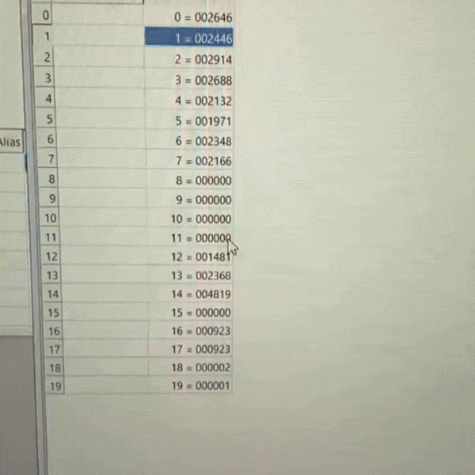

# STM32 Sensor Module with Modbus RTU

_Demo showing MQ2 gas detection and live Modbus register updates via MBPoll_

STM32-based Modbus RTU slave exposing 4× MQ2 gas sensors and an SCD30 environmental sensor over RS485 — built for the Smash Bot Arena at ROBOCOMP 2025, KN Integra's robotics competition at AGH University. Used alongside the LED display module during the event.

One of two modules in the system: see also [STM32-32x16_RGB_LED](https://github.com/JackobPunch/STM32-32x16_RGB_LED).

## Features

- Modbus RTU slave over RS485 at 9600 baud — all sensor values exposed as holding registers
- 4× MQ2 gas sensors: analog ADC (24μs conversion) + digital threshold per channel
- SCD30 environmental sensor: CO₂, temperature, humidity over I2C with CRC validation
- Automatic error recovery: activity monitoring, timeout reset, software watchdog
- <9% Modbus error rate after timing and recovery optimization (down from ~40%)

## Development Path

| Folder | Status | Description |
|--------|--------|-------------|
| `ledBlinking/` | Complete | HAL setup and GPIO basics |
| `modbusTrying/` | Complete | Standalone Modbus RTU slave — main implementation |
| `MQ2_1/` | Complete | ADC-based gas detection |
| `SCD30/` | Complete | I2C CO₂/temp/humidity with CRC validation |
| `ModbusRTOS/` | Experimental | FreeRTOS + Modbus (future scope) |

## Hardware

| | |
|---|---|
| MCU | STM32F303K8T6 (Cortex-M4, 64 MHz) |
| Board | NUCLEO-F303K8 |
| Sensors | 4× MQ2 (gas), SCD30 (CO₂/temp/humidity via I2C) |
| Communication | RS485 Modbus RTU, 9600 baud |

## Modbus Register Map

| Register | Value |
|----------|-------|
| 0x0001–0x0004 | MQ2 analog [0–4095] |
| 0x0005–0x0008 | MQ2 digital threshold [0/1] |
| 0x0009 | CO₂ [ppm] |
| 0x000A | Temperature [°C × 100] |
| 0x000B | Humidity [% × 100] |
| 0x000C | System status |

## Hardware Note

**PA5/PA6 must be left unconnected** — connecting anything to these pins disables I2C on PB6/PB7 entirely (likely internal crosstalk on STM32F303K8). MQ2 digital inputs use PA8, PA11, PB5, PB4 instead.

## Dependencies

- [stModbus](https://github.com/urands/stModbus) — Modbus RTU library
- STM32 HAL, ARM GCC, STM32CubeIDE
